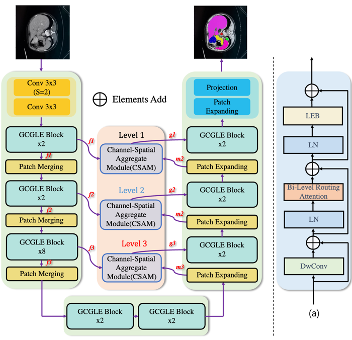
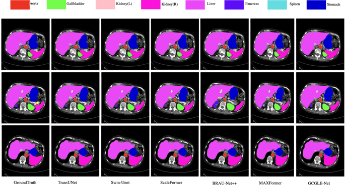
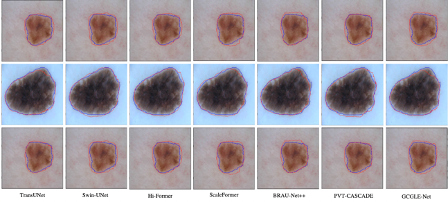
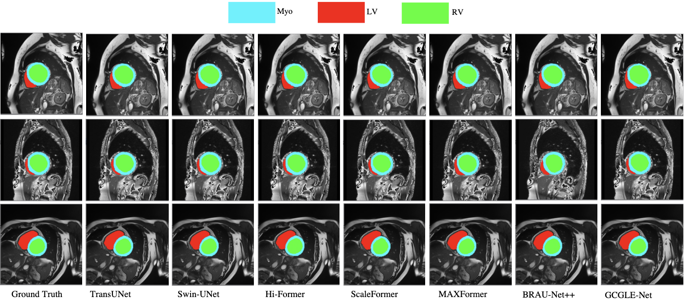

# GCGLE-Net: Global Contextual Guided Local Extraction Network for Medical Image Segmentation
- Accurate medical image segmentation is beneficial for clinical diagnosis, postoperative treatment,
and the specification of clinical methods. Currently, most medical image segmentation techniques are
based on deep learning methods using CNNs and Transformers. However, due to CNNs’ poor long-
range modeling capabilities, they are gradually being surpassed by Transformer-based approaches.
Although Transformer methods have achieved significant success in the field of medical imaging,
they often overlook the extraction of local information and channel spatial information, which
can enhance segmentation performance. We propose a Global Contextual Guided Local Extraction
Network(GCGLE-Net) that incorporates a Local Extraction Block (LEB) to effectively capture local
information from the global context and integrate feature information. To better extract channel spatial
information across varying scales, we introduce a Channel-Spatial Aggregation Module (CSAM).
We conduct experiments on three mainstream medical image segmentation datasets and achieved
state-of-the-art(SOTA) results 


<center>The overall architecture diagram of GCGLE-Net, figure(a) represents GCGLE block, which can effectively extract  </center>
local information from the global information extracted in BRA.

## 1. data and Model weights
### Synapse
- Get [Synapse data](https://drive.google.com/drive/folders/1ACJEoTp-uqfFJ73qS3eUObQh52nGuzCd), model weights of our GCGLE-Net come soon.
### ISIC-2018
- Get [ISIC-2018 data](https://challenge.isic-archive.com/data/), model weights of our GCGLE-Net come soon.
### ACDC
- Get [ACDC data](https://drive.google.com/file/d/13qYHNIWTIBzwyFgScORL2RFd002vrPF2/view), model weights of our GCGLE-Net come soon.
## 2. Environment
- Please prepare an environment with python=3.10, and then use the command "pip install -r requirements.txt" for the dependencies.

## 3. Synapse Train/Test

- Train
```bash
python train.py --dataset Syanpse --root_path your DATA_DIR --max_epochs 400 --output_dir your OUT_DIR  --img_size 224 --base_lr 0.05 --batch_size 24
```
- Test 

```bash
python test.py --dataset Synapse --is_savenii --volume_path your DATA_DIR --output_dir your OUT_DIR --max_epoch 400 --base_lr 0.05 --img_size 224 --batch_size 24
```

## 4. ISIC-2018 Data Train/Test
ISIC-2018 Data [generation train and test](./isic_cvc_train_test/README.md) 

## 5. ACDC Train/Test

- Train
```bash
python train3.py --dataset ACDC --root_path your DATA_DIR --max_epochs 250  --img_size 224 --base_lr 0.01 --batch_size 24
```
- Test
```bash
python test1.py --dataset ACDC --is_savenii --volume_path your DATA_DIR  --max_epoch 250 --base_lr 0.05 --img_size 224 --batch_size 24
```
## 6. Experiments Results
### Synapse

<center>Visualize segmentation maps of different SOTAs on the Synapse dataset.</center>

### ISIC-2018 Challenge 

<center>Visual Segmentation maps of different SOTAs on the ISIC2018 dataset, where blue represents the true label values and
red represents the predicted values  </center>


### ACDC Data1

<center>Visual segmentation maps of different SOTAs on the ACDC dataset.</center>

## References
* [BiFormer](https://github.com/rayleizhu/BiFormer)
* [BRAU-Net++]()
* [DAE-Former](https://github.com/xmindflow/DAEFormer)
* [DCSAU-Net](https://github.com/xq141839/DCSAU-Net)


